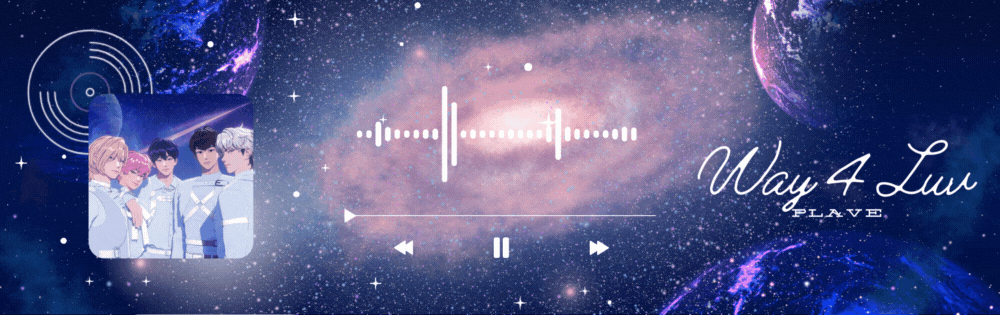

<h2 align="center">
    💙💜💗❤️🖤 
Play Reeve - Play Reality
</h2>
<h3 align="center">
    Song Of The Day 🌌💿  

        
    

<h4 align="center">
     Today's Update 🌀 

##### 🐬 Every day, on behalf of Yejunie, I deliver a story about the marine.

> Whales sing songs in the ocean. They're like underwater concerts. They use these songs to talk to other whales and maybe even find their way around.

##### 🦙 Every day, on behalf of our Noah, I share an interesting quote.

> "Love, friendship and respect do not unite people as much as a common hatred for something." - Anton Chekhov

##### 🦌 Every day, on behalf of dear Bamby-nie, I share a beautiful word with meaning.

> Euphoria
>
> > (n) / juːˈfɔːrɪə /  
> > A state of extreme happiness.

##### 🐺 Every day, on behalf of Silver-ho, I offer a riddle.

> A man comes home from work, hangs up his coat, feeds his dog, brushes his teth and turns out the light. In the morning he wakes up and realizes he had done something terribly, terribly wrong and kills himself. What did he do wrong? (Big hint: his job involves boats.)

🕺🏻 Reveal the answer here 🕺🏻

 
The man was a lighthouse operator (which also means that he lives in the lighthouse). When he turned out the light he turned out the lighthouse light, resulting in several boat crashes overnight. He knew he was responsible, and would be in lots of trouble so he killed himself.

##### 🐈‍⬛ OKAYY!! Lastly, on behalf of Haminie, I share a photo you may like to see.

    brown rock formation under blue sky

 &nbsp;
 &nbsp;
 &nbsp;
 &nbsp;
 &nbsp;

---

#### Techs and Tools used to create this file

    
  &nbsp;&nbsp;
    
  &nbsp;&nbsp;
    
  &nbsp;&nbsp;
      

#### APIs used

**_Quote:_** [API Ninja - Quotes](https://api-ninjas.com/api/quotes) 
**_Riddle:_** [API Ninja - Riddles](https://api-ninjas.com/api/riddles) 
**_Photo:_** [Unsplash](https://unsplash.com/developers) 
**_Weather:_** [OpenWeather](https://openweathermap.org)

---

##### This file is updated every day. Last time at: 18.00 🐢💚

---
